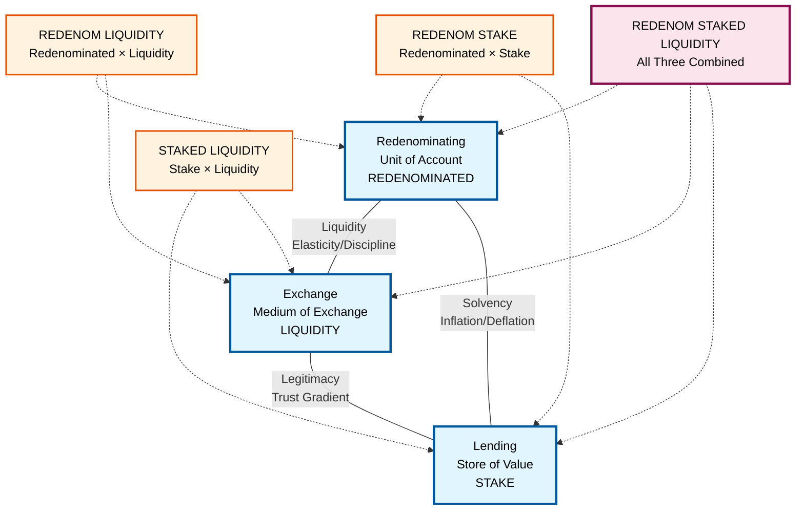
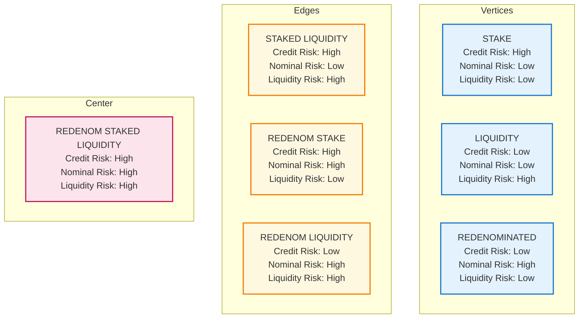

# Monetary Triangle

## Overview

This document presents a complete risk framework that maps position types to the fundamental monetary functions and their associated risk profiles. Each position represents a pure transformation in the monetary design space with specific risk characteristics.

## The Monetary Triangle

- **Vertices**: Large nodes with primary positions
- **Edges**: Positioned between relevant vertices
- **Center**: Central position combining all monetary functions
- **Solid Lines**: The fundamental monetary dimensions
- **Dotted Lines**: Position relationships to functions

### Position Properties

## Position Details

### 1. Stake Position → Lending
**Transformation**: Token → Time-locked Token + Protocol Asset Creation
- **Parameters**: `{amount, pair, duration}` where `pair` specifies the protocol asset created
- **Input**: Base token (creates protocol assets) or existing protocol tokens
- **Output**: Non-transferable position with lock duration + collateralized protocol asset
- **Risk**: Credit risk (high) - protocol counterparty risk
- **Dimension**: Store of Value function

### 2. Liquidity Position → Exchange
**Transformation**: Token → Exchange Offer at Tick
- **Parameters**: `{amount, pair, tickRate}` where `pair` specifies the token pair
- **Input**: Base token or protocol tokens at specific tick rate
- **Output**: Transferable position representing standing offer
- **Risk**: Liquidity risk (high) - may be filled at tick rate
- **Dimension**: Medium of Exchange function

### 3. Redenominated Position → Redenominating
**Transformation**: Asset → Leveraged Asset Expression
- **Parameters**: `{amount, pair, leverageRate}` where `leverageRate` is expressed as rate (0.5 = 50% additional exposure)
- **Input**: Base token or protocol tokens
- **Output**: Position with specified leverage multiplier (leverageRate + 1.0 = total exposure)
- **Risk**: Nominal risk (high) - full exposure to relative value changes
- **Dimension**: Unit of Account function

### 4. StakedLiquidity Position → Stake × Liquidity
**Transformation**: Token → Time-locked LP Position
- **Parameters**: `{amount, duration, pair, tickRate}` (union of Stake + Liquidity parameters)
- **Combines**: Time-locked lending with liquidity provision
- **Input**: Base token or protocol tokens
- **Output**: Staked liquidity position with credit risk (high) + liquidity risk (high)
- **Risk**: Credit risk (high) + Liquidity risk (high)
- **Dimension**: Store of Value + Medium of Exchange functions
- **Example**: Time-locked LP tokens, bonded liquidity provision

### 5. RedenominatedStake Position → Redenominated × Stake
**Transformation**: Token → Leveraged Time-locked Position
- **Parameters**: `{amount, duration, pair, leverageRate}` (union of Redenominated + Stake parameters)
- **Combines**: Leveraged exposure with time-locked lending
- **Input**: Base token or protocol tokens
- **Output**: Leveraged staking position with nominal risk (high) + credit risk (high)
- **Risk**: Nominal risk (high) + Credit risk (high)
- **Dimension**: Unit of Account + Store of Value functions
- **Example**: Leveraged staking, margin staking positions

### 6. RedenominatedLiquidity Position → Redenominated × Liquidity
**Transformation**: Token → Leveraged LP Position
- **Parameters**: `{amount, pair, tickRate, leverageRate}` (union of Redenominated + Liquidity parameters)
- **Combines**: Leveraged exposure with liquidity provision
- **Input**: Base token or protocol tokens
- **Output**: Leveraged liquidity position with nominal risk (high) + liquidity risk (high)
- **Risk**: Nominal risk (high) + Liquidity risk (high)
- **Dimension**: Unit of Account + Medium of Exchange functions
- **Example**: Leveraged LP positions, margin AMM provision

### 7. RedenominatedStakedLiquidity Position → All Three Combined
**Transformation**: Token → Complete Position
- **Parameters**: `{amount, duration, pair, tickRate, leverageRate}` (union of all vertex parameters)
- **Combines**: Leveraged exposure, time-locked lending, and liquidity provision
- **Input**: Base token or protocol tokens
- **Output**: Center position with credit risk (high) + nominal risk (high) + liquidity risk (high)
- **Risk**: Credit risk (high) + Nominal risk (high) + Liquidity risk (high)
- **Dimension**: Unit of Account + Store of Value + Medium of Exchange functions
- **Complexity**: Highest (combines all monetary functions)
- **Example**: Comprehensive position, full monetary participation

## Conclusion

The monetary triangle provides a framework to think about the fundamental monetary design space, with positions as the building blocks for risk-aware financial transformations.