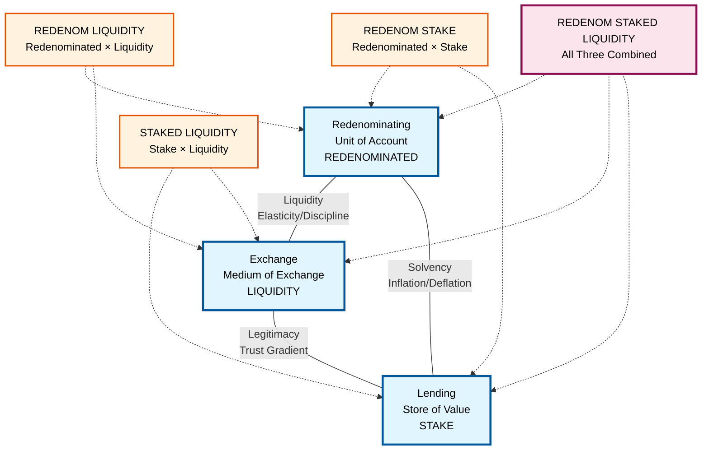
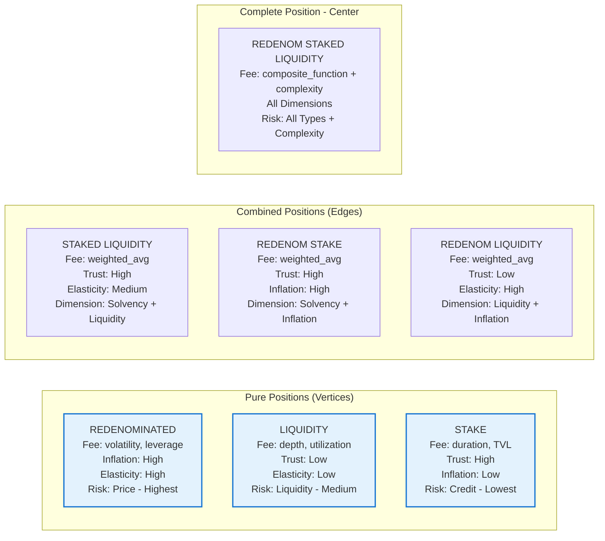

# Feels Protocol: Harmonized Conceptual Framework

## Overview

This document presents a complete conceptual framework for the Feels protocol, mapping position types to the fundamental monetary functions and their combinations. Each position represents a pure transformation in the monetary design space.

## The Monetary Triangle with Feels Positions



### Position Mapping Key
- **Vertices (Pure Functions)**: Large nodes with primary positions
- **Edges (Two-Function Combinations)**: Positioned between relevant vertices
- **Center (Three Functions)**: Central position combining all monetary functions
- **Solid Lines**: The fundamental monetary dimensions
- **Dotted Lines**: Position relationships to functions

## Detailed Position Properties



## The Three Primitive Positions

### 1. Stake Position → Lending (Pure)
**Transformation**: Token → Time-locked Token + Feels Asset Creation
- **Parameters**: `{amount, pair, duration}` where `pair` specifies the feels asset created
- **Input**: SOL (creates feels assets) or existing feels tokens
- **Output**: Non-transferable position with lock duration + collateralized feels asset
- **Fee Function**: `base_fee × (1 + duration_days/180) × (1 + 1/sqrt(total_staked))`
- **Trust**: High (lending side of legitimacy dimension)
- **Risk**: Credit risk (lowest) - only protocol counterparty risk
- **Collateral**: 75% collateralization ratio for SOL→feels asset creation
- **Note**: SOL stakes are the **only way** feels assets enter the system

### 2. Liquidity Position → Exchange (Pure)
**Transformation**: Token → Exchange Offer at Tick
- **Parameters**: `{amount, pair, tickRate}` where `pair` specifies the token pair
- **Input**: SOL or feels tokens at specific tick rate
- **Output**: Transferable position representing standing offer
- **Fee Function**: `base_fee × (1 + 1/tick_depth) × (1 + utilization_rate) × tier_multiplier`
- **Trust**: Low (exchange side of legitimacy dimension)
- **Elasticity**: Low (disciplined by exchange mechanism)
- **Risk**: Liquidity risk (may be filled at tick rate)

### 3. Redenominated Position → Redenominating (Pure)
**Transformation**: Asset → Leveraged Asset Expression
- **Parameters**: `{amount, pair, leverageRate}` where `leverageRate` is expressed as rate (0.5 = 50% additional exposure)
- **Input**: SOL or feels tokens
- **Output**: Position with specified leverage multiplier (leverageRate + 1.0 = total exposure)
- **Fee Function**: `base_fee × (1 + implied_volatility) × leverage_ratio × (1 + 1/liquidity_depth)`
- **Inflation**: High (higher multiples = higher inflation of exposure)
- **Risk**: Price risk (highest) - full exposure to relative value changes

## The Three Edge Positions (Two-Function Combinations)

### 4. StakedLiquidity Position → Stake × Liquidity
**Transformation**: Token → Time-locked LP Position
- **Parameters**: `{amount, duration, pair, tickRate}` (union of Stake + Liquidity parameters)
- **Combines**: Time-locked lending with liquidity provision
- **Input**: SOL or feels tokens
- **Output**: Staked liquidity position with credit + liquidity risk
- **Fee Function**: `0.5 × stake_fee(duration) + 0.5 × liquidity_fee(utilization)`
- **Trust**: High (from stake component)
- **Elasticity**: Medium (liquidity provides some elasticity)
- **Dimension**: Operates between solvency and liquidity edges
- **Example**: Time-locked LP tokens, bonded liquidity provision

### 5. RedenominatedStake Position → Redenominated × Stake  
**Transformation**: Token → Leveraged Time-locked Position
- **Parameters**: `{amount, duration, pair, leverageRate}` (union of Redenominated + Stake parameters)
- **Combines**: Leveraged exposure with time-locked lending
- **Input**: SOL or feels tokens
- **Output**: Leveraged staking position with price + credit risk
- **Fee Function**: `0.3 × stake_fee(duration) + 0.7 × redenom_fee(leverage_rate)`
- **Trust**: High (from stake component)
- **Inflation**: High (leverage amplifies price movements)
- **Dimension**: Operates between solvency and inflation edges  
- **Example**: Leveraged staking, margin staking positions

### 6. RedenominatedLiquidity Position → Redenominated × Liquidity
**Transformation**: Token → Leveraged LP Position
- **Parameters**: `{amount, pair, tickRate, leverageRate}` (union of Redenominated + Liquidity parameters)
- **Combines**: Leveraged exposure with liquidity provision
- **Input**: SOL or feels tokens
- **Output**: Leveraged liquidity position with price + liquidity risk
- **Fee Function**: `0.4 × liquidity_fee(utilization) + 0.6 × redenom_fee(leverage_rate)`
- **Trust**: Low (from liquidity component)
- **Elasticity**: High (leverage + liquidity provide high elasticity)
- **Dimension**: Operates between liquidity and inflation edges
- **Example**: Leveraged LP positions, margin AMM provision

### 7. RedenominatedStakedLiquidity Position → All Three Combined
**Transformation**: Token → Complete Position
- **Parameters**: `{amount, duration, pair, tickRate, leverageRate}` (union of all vertex parameters)
- **Combines**: Leveraged exposure, time-locked lending, and liquidity provision
- **Input**: SOL or feels tokens
- **Output**: Center position with all three risk types + complexity premium
- **Fee Function**: `(stake_fee + liquidity_fee + redenom_fee) / 3 × 1.2` (20% complexity premium)
- **Trust**: Gradient across all dimensions
- **Complexity**: Highest (combines all monetary functions)
- **Dimension**: Operates at the center of all three edges
- **Example**: Comprehensive DeFi position, full protocol participation


## Asset Hierarchy and Routing

### Asset Types
The system distinguishes between two asset categories:

1. **Base Assets**: `SOL` (user-supplied, external to the system)
2. **Feels Assets**: `TokenA`, `TokenB` (system-issued, created through SOL staking)

### Asset Creation Rules
- **Primary Creation**: Only SOL stakes can create feels assets (TokenA/TokenB)
- **Collateralization**: 75% collateral ratio (1 SOL staked → 0.75 feels asset created)
- **Pairing Rule**: All operations must be Base Asset ↔ Feels Asset pairs (no direct Feels ↔ Feels operations)
- **Entry Point**: SOL staking is the **only way** feels assets enter the system

### Routing and Transformation
- **Secondary Positions**: Created by transforming base or feels assets into vertex positions
- **Tertiary Positions**: Created by transforming secondary assets into edge positions  
- **Quaternary Positions**: Created by transforming tertiary assets into center positions
- **Multi-step Routing**: Users can create complex positions through multiple transformation paths
- **Fee Accumulation**: Total fee = sum of all transformation fees along the route

## Position Composition Rules

### Valid Compositions
1. **Associative Composition (Same Position Types)**
   - Same-type positions combine by adding amounts and merging parameters
   - Stake + Stake: adds `amount` and `duration`, inherits latest `pair`
   - Liquidity + Liquidity: adds `amount`, averages `tickRate`, inherits `pair`
   - Redenominated + Redenominated: adds `amount` and `leverageRate`, inherits `pair`

2. **Layered Composition (Different Position Types)**
   - Creates new edge/center positions with union of parameters
   - Stake + Liquidity → StakedLiquidity: `{amount, duration, pair, tickRate}`
   - Redenominated + Stake → RedenominatedStake: `{amount, duration, pair, leverageRate}`
   - Any two → Edge, Any three → Center

3. **Parameter Inheritance Rules**
   - Edge positions inherit **all** parameters from constituent vertices
   - Center position inherits **all** parameters from all three vertices
   - Compositional positions are **strictly defined** by parameter unions

### Invalid Compositions
1. **Cross-Feels Asset Operations**
   - No direct TokenA ↔ TokenB operations allowed
   - All operations must pair Base Asset (SOL) ↔ Feels Asset (TokenA/TokenB)
   
2. **Feels Asset Creation**
   - Only SOL stakes can create feels assets
   - Cannot create feels assets from existing feels assets

## Fee Structure Philosophy

The fee multiplier system dynamically adjusts based on system properties, with fees inversely proportional to risk assumed:

| Function | Risk Type | Fee Function | Key Variables |
|----------|-----------|--------------|---------------|
| Redenominating | Price Risk (Highest) | `f(volatility, leverage_ratio, liquidity_depth)` | • Higher volatility → higher fees<br>• Higher leverage → higher fees<br>• Lower liquidity → higher fees |
| Exchange | Liquidity Risk (Medium) | `f(tick_depth, utilization, spread)` | • Lower tick depth → higher fees<br>• Higher utilization → higher fees<br>• Wider spread → higher fees |
| Lending | Credit Risk (Lowest) | `f(duration, total_staked, protocol_revenue)` | • Longer duration → higher fees<br>• Lower total staked → higher fees<br>• Higher protocol revenue → higher fees |
| Combined Functions | Multiple Risks | `weighted_avg(component_fees)` | Weighted by position composition |

## Risk Decomposition

Each position type has characteristic risks aligned with its function:

### Price Risk (Redenominating)
- **Primary in**: Redenominated positions
- **Nature**: Relative value changes between denominations
- **Mitigation**: No liquidation, bounded loss

### Liquidity Risk (Exchange)
- **Primary in**: Liquidity positions
- **Nature**: May not find counterparty at desired rate
- **Mitigation**: Tiered system ensures depth

### Credit Risk (Lending)
- **Primary in**: Staked positions
- **Nature**: Protocol may not honor time commitments
- **Mitigation**: Non-custodial design, no counterparty

## Practical Position Strategies

### 1. Conservative Yield
```
Token → Stake(30d) → 1.25x multiplier
```
Pure store of value with medium duration, lowest risk

### 2. Active Market Making
```
Token → Liquidity(Anchor) → 2.5x multiplier
```
Pure exchange at concentrated tick, medium liquidity risk

### 3. Risk-Taking Strategy
```
Token → Redenominated(2x SOL) → 3x multiplier
```
Maximum price risk exposure for highest fees

### 4. Recursive Risk Strategy
```
SOL → Redenominated(2x) → Redenominated(2x) → 4x multiplier
```
Compounded leverage for maximum fee compensation

## Mathematical Properties

### Mathematical Properties

#### Associativity (Property Tested)
All same-type position compositions are associative:
- `Stake(Stake(Token, params1), params2) = Stake(Token, combined_params)`
- `Redenominated(Redenominated(Token, rate1), rate2) = Redenominated(Token, rate1 + rate2)`
- `Liquidity(Liquidity(Token, params1), params2) = Liquidity(Token, averaged_params)`

#### Identity (Property Tested)  
Each position type has mathematical identity elements:
- `Stake(Token, {amount: 0, duration: 0})` ≈ Token
- `Redenominated(Token, {leverageRate: 0.0})` ≈ Token (no additional leverage)
- `Liquidity(Token, {amount: 0, tickRate: current})` ≈ Token

#### Property-Based Testing
The system includes QuickCheck property tests verifying:
- **Redenomination Associativity**: Composition order independence
- **Identity Laws**: Identity elements preserve original values
- **Risk Consistency**: Risk types are preserved across compositions

## Implementation Architecture

### Generic Composition System
The implementation uses a unified composition system:
- **`composeAssociative`**: Handles same-type compositions with parameter merging
- **`composePosition`**: Intelligently routes to associative or layered composition
- **Parameter Union**: Edge/center positions automatically inherit all constituent parameters
- **Type Safety**: PureScript's type system enforces compositional correctness

### Collateral Management
- **Hard-coded Ratio**: Currently 75% collateralization for SOL→feels asset creation
- **Future Enhancement**: Dynamic collateral ratios based on market conditions
- **Risk Mitigation**: Over-collateralization provides buffer against volatility

## Conclusion

The Feels protocol implements a complete position system spanning the monetary function design space. By maintaining functional purity and allowing controlled composition, it enables users to construct precisely the risk/return/trust profiles they desire. The fee multiplier system creates appropriate incentives for each function while the composability rules ensure system coherence.

This harmonized framework shows Feels not as a collection of features, but as a systematic exploration of the fundamental monetary design space, with positions as the building blocks for arbitrary financial transformations.